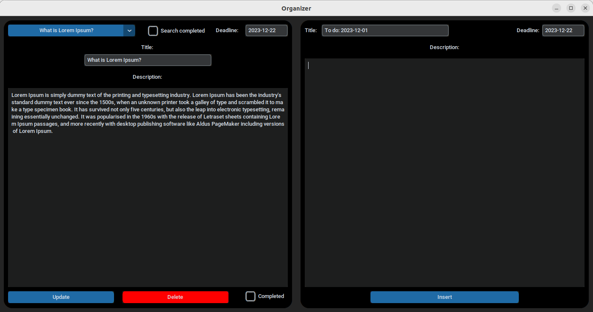

# Projekt organizer
Jest to projekt realizujący organizer, w którym możemy w wygodny sposób planować dzień, a także zapisywać i edytować ważne dla nas
informacje np. wymagania do jakiegoś zadania.

# create_database.py:
Klasa ta jest używana do połączenia z bazą danych, tworzeniem bazy jeśli jej nie ma, a także posiada metody do modyfikacji bazy.
Używam SqlAlchemy w celu łatwiejszej pracy z bazą
### Metoda initialize_database():
tworzy wszystkie tabele w bazie danych, jeśli jeszcze ich nie ma, i zamyka sesję, po ewentualnym zakończeniu transakcji.
### Metoda select_all_data(checkbox)
zwraca zadania z bazy danych, posortowane według daty wykonania, bądź odwrotnie, w zależności od wartości parametru checkbox.
### Metoda insert_data(title, description, date) 
dodaje nowe zadanie do bazy danych z podanymi tytułem, opisem i datą wykonania.
### Metoda update_data(task_id, new_title, new_description, new_date, new_completed)
aktualizuje istniejące zadanie o podanym task_id nowymi danymi: tytułem, opisem, datą wykonania i stanem ukończenia.
### Metoda delete_record(id)
usuwa zadanie o określonym identyfikatorze id z bazy danych.

# main.py:
Ta klasa jest odpowiedzialna za inicjalizację bazy danych oraz uruchomienie głównego interfejsu użytkownika, umożliwiając interakcję użytkownika z aplikacją.

# main_panel.py:
Ta klasa jest odpowiedzialna za statyczne ułożenie elementów w ramce. Aplikacja nie jest responsywna.

# main_panel_manager.py:
Jest to klasa odpowiaddająca za logikę aplikacji. Przykładowo gdy aktualizujemy text w jednej notatce to zostaje to załadowane
do bazy danych, a następnie wszystkie dane są pobierane na nowo i wstrzykiwane do odpowiednich pól
dzięki czemu nie trzeba wyłączać aplikacji tak aby widzieć aktualne dane. 

### Metoda update_all_attributes() 
aktualizuje atrybuty obiektu master (głównego interfejsu użytkownika) na podstawie danych pobranych z bazy danych.
### Metoda update(*args) 
aktualizuje wybrane zadanie na podstawie wyboru z menu, aktualizując pola w interfejsie użytkownika.
    
### Metoda update_menu(list_of_titles) 
aktualizuje opcje w menu rozwijanym na podstawie podanej listy tytułów.
### Metoda update_data() 
aktualizuje dane wybranego zadania na podstawie wprowadzonych przez użytkownika informacji.
### Metoda insert() 
dodaje nowe zadanie na podstawie danych wprowadzonych przez użytkownika.
### Metoda delete() 
usuwa wybrane zadanie.
### Metoda search() 
odświeża widok na podstawie wyników wyszukiwania.
### Metoda first_occurrence() 
ustawia pierwsze zadanie z listy jako aktualnie wybrane w interfejsie użytkownika.
### Metoda get_task_by_title(title, tasks) 
zwraca identyfikator zadania na podstawie tytułu.
### Metoda all_titles(tasks) 
zwraca listę wszystkich tytułów z listy zadań.
### Metoda all_descriptions(tasks) 
zwraca listę wszystkich opisów z listy zadań.
### Metoda all_deadlines(tasks) 
zwraca listę wszystkich terminów wykonania z listy zadań.
### Metoda all_completed(tasks) 
zwraca listę wszystkich statusów ukończenia z listy zadań.
### Metoda all_id(tasks) 
zwraca listę wszystkich identyfikatorów z listy zadań.

# message_panel.py:
Klasa która tworzy okno z dowolną wiadomością jaką przekażemy do obiektu.
### Klasa MessagePanel  
Tworzy panel wiadomości o określonym tekście, wymiarach, kolorze tekstu i wyśrodkowuje go w oknie. Klasa ta jest używana do wyświetlania komunikatów użytkownikowi w postaci panelu pop-up w aplikacji GUI opartej na customtkinter.